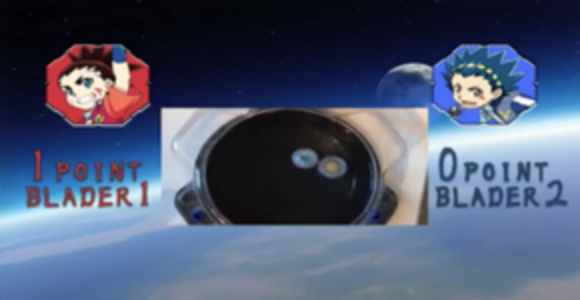
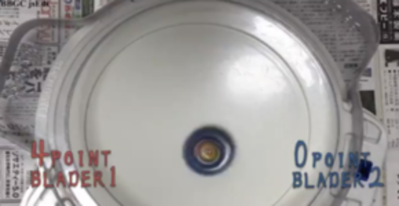
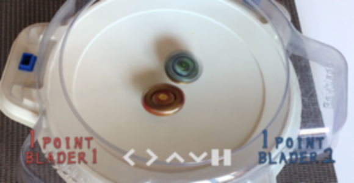

# B2S2シリーズ

## 概要
B2S2（BEYBLADE SCORE SYSTEM）  
ベイブレードバーストのスコア支援システムです  
現時点でPC版とiOS版を展開しています（2019年11月時点）

旧名：BBSS

## BBGC edi

2018/11/25 に開催されたBBGCに向けて開発したシステム

iPhoneのカメラで取得した映像をPCに転送し、  
その映像をスコアを制御するプログラムにレイヤーに乗っけました

できあがったレイヤーは仮想カメラの映像としても出力できるので  
その映像を `QuickTime` などのソフトで録画したり、  
`YouTubeLive` などで生放送もすることが可能である

モデルは『ベイブレードバースト世界大会2018』

## js edi

一言で表すと、全画面対応版  
Javaで書いていたものをJavaScriptで書き直した

WEBアプリ開発環境である  
`Electron` を用いることで全画面に対応可能となった

開発環境を起動しぱなっしの前作と比べて、  
PCへの負担が極端に減った  
ロジックは前作とほぼ同じ

モデルは『ベイブレードバーストG1大会』

## iPhoneApp edi ver.α

ついに作ってしまった  
これまで利用していたカメラ機能をそのまま流用した  
そしたらなんかできてしまった

`Extra Views` と呼ばれるViewにパーツを載せ、カメラのレイヤーに乗っけた  
モニタやプロジェクタに繋げれば、そのままBBGC ediと同じ機能が使える  
場所も取りません

iPhoneだけでスコア制御、録画を実現した  
録画した映像は保存が可能なので、そのままTwitterに投稿したり  
LINEでチームへ共有などが可能である

コンセプトは「片手で」

## iPhoneApp edi ver.β
執筆準備中

## androidApp edi
現在開発中！
