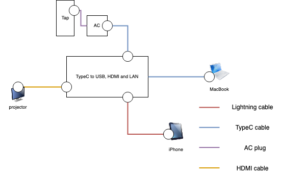

# BBGCedi

## 概要
2018/11/25開催のBBGCに向けて作成したシステム

iPhoneのカメラで取得した映像をPCに転送し、  
その映像をスコアを制御するプログラムのレイヤーに乗っける

できあがったレイヤーは仮想カメラの映像として出力できるので  
`QuickTime` などのソフトで録画したり、 `YouTubeLive` などでも生放送ができる

## 構成図
### BBGC、Beyfes

## 開発環境

* iPhone
    + iPhone7plus
* OS
    + MacOS, Windows10
* 言語
    + Java
* プラットフォーム
    + Processing
* 仮想カメラ
    + ManyCam
    + CamTwist
* 出力
    + QuickTime Player

## BBGC当日構成
### ハードウェア、ソフトウェア

* iPhone
    + iPhone7plus
* OS
    + MacOS
* 言語
    + Java
* プラットフォーム
    + Processing
* 仮想カメラ
    + CamTwist
* 出力
    + QuickTime Player

### グッズ

* スマホケース
* スマホアーム
* HDMIケーブル
* Lightningケーブル
* マウス
* テンキー

* TypeC-HDMI, LAN, USB変換
* 電源タップ
* MacBook充電器

* PCテーブル

## デモ
`準備中`

## 裏話
→ [見に行く](inside/BBGCedi_inside.md)
