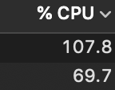

# BBGCedi_Inside

## はじめに
このページはBBGCediを作成するにあたっての裏話です

## 爆熱CPU
Processingでの画面設計、iPhoneからの映像取得ならびに処理、プレビューによりアチアチ  
当時CPUは100%はゆうに超えていたことでしょう  
こんなんじゃ何分間も続くようじゃPCが持たねえ  

参考画像



## テスト環境作成に約1万円するソフト買いました
はい、マジで買いました  
いろんなシーンごとに場合分けもできるし？  
実績も豊富？

束の間の幸福ううう、うわあああ。。。  
CPUがどんどん跳ね上がるううう  
そうです、そうなんです  
高スペ向けの製品なので並みのMacBookでは歯が立ちません  
一応MacBookProっすよ。。。メモリ16は必要ですね、あとCPU増強

結局はソースコードの見直しと低負荷な代替ソフトでCPUを抑えましたとさ

## 実は頭イッてる画面切り替えのロジック
これはマジでイッてる  
順に説明しますね

１. 背景を描画  
２. スコア、プレイヤー画像を描画  
↑ここまではいいんです

さあ、スコアが変動したとき、どうなるでしょうか？  
はい、正解は。。。  
上塗りです  
１と２を繰り返してます  
スコアが変動する度に、プレイヤーが変わる度に  
あららーらーらーらー

図で表すとこんな感じ↓

```
準備中。。。
```
