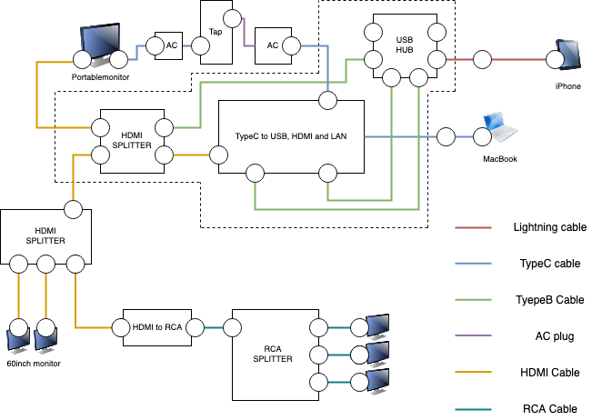

# iPhoneAPPediVerβ

## 概要
前作のα版を改良したver  
`Springライブラリ` を用いることでgifアニメを使うことなくアニメーションを実現

`TwitCasing Game` との連携を成功させた  
これにより、iPhone単体での中継が可能に  
しかし、プロジェクタなどに接続する場合はPCをかます必要がある

## 構成図
KMMKKK新橋 初期原案  

KMMKKK新橋 完全版  

## 開発環境

* iPhone
    + iPhone7plus
    + iPhone11
* OS
    + MacOS
    + iOS
* 言語
    + Swift
* プラットフォーム
    + Xcode
* 出力
    + QuickTime Player

## BBGC当日構成
### ハードウェア、ソフトウェア

* iPhone
    + iPhone7plus
    + iPhone11
* 出力
    + QuickTime Player
    + monitor
    + TwitCasing Game

### グッズ

* スマホケース

* HDMIケーブル
* Lightningケーブル
* Lightningケーブル延長

* TypeBケーブル
* TypeCケーブル
* USB HUB
* TypeC L型

* TypeC-HDMI, LAN, USB変換
* MacBook充電器

## デモ
`準備中`

## 裏話
<!-- → [見に行く](inside/XXX_inside.md) -->
